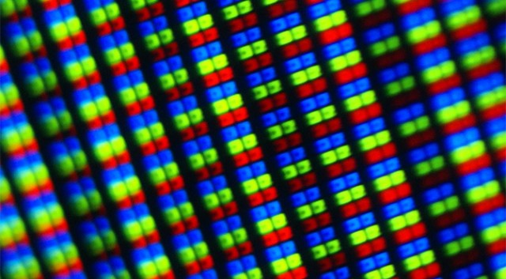

## Intro

+ [Download Processing](https://processing.org/download/)
+ Introductions

## What Can it Do?

+ [Quayola - Iconographies](https://quayola.com/work/series/iconographies-series.php)
+ [Graffiti Research Lab - Laser Tag](http://www.graffitiresearchlab.com/blog/projects/laser-tag/)
+ [Softlab - Volume](https://softlabnyc.com/portfolio/volume/)
+ [Antonin Fourneau - Water Light Graffiti](https://vimeo.com/47080920)
+ [Barbican - Rain Room](https://www.youtube.com/watch?v=EkvazIZx-F0)
+ [... more](http://graysonearle.com/edu/physcom/relevant-projects-artists/)

## Processing Lab

+ Pixel theory, color theory

+ Functions used ([use the reference to review](https://processing.org/reference/)):
	+ background
	+ fill()
	+ stroke()
	+ noStroke()
	+ line()
	+ size()
	+ setup()
	+ draw()
	+ mouseX, mouseY
	+ width, height
	+ random()

## Extended Resources and Opportunities

+ [Dan Shiffman's Learning Processing Book](http://learningprocessing.com/)
+ [Dan Shiffman's YouTube tutorial series](https://www.youtube.com/user/shiffman/videos?app=desktop)
+ [School for Poetic Computation](https://sfpc.io/)
+ [ITP Summer Camp](https://itp.nyu.edu/camp2019/)
